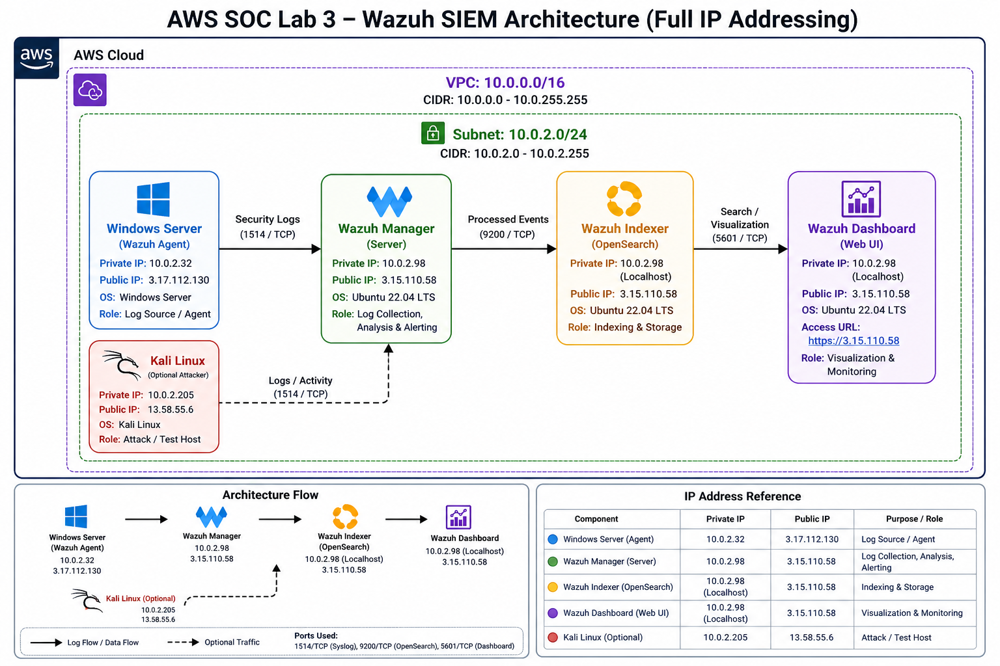

# AWS SOC Lab 3 – Wazuh SIEM Deployment

## 📌 Objective

Deploy and configure a Wazuh SIEM in AWS to enable centralized log collection, processing, and monitoring.

---

## 🏗️ Environment

* Wazuh Server (Ubuntu) – SIEM platform
* Windows Server – Log source (agent)
* Linux System (Optional) – Additional log source

---

## 🌐 Network Details

* VPC: 10.0.0.0/16
* Subnet: 10.0.2.0/24

| System     | Private IP | Public IP    |
| ---------- | ---------- | ------------ |
| Windows    | 10.0.2.32  | 3.17.112.130 |
| Kali/Linux | 10.0.2.205 | 13.58.55.6   |
| Wazuh      | 10.0.2.98  | 3.15.110.58  |

---

## 🖼️ Architecture Diagram



---

## ⚙️ Installation

### Download Installer

```
curl -sO https://packages.wazuh.com/4.7/wazuh-install.sh
```

### Install Wazuh

```
sudo bash wazuh-install.sh -a
```

---

## 🔐 Access Dashboard

https://3.15.110.58:5601

---

## 🧪 Validation

* Dashboard loads over HTTPS
* Login successful
* Services running
* Indexer responding

---

## 🔍 Key Troubleshooting

### Dashboard not loading

```
sudo systemctl restart wazuh-dashboard
```

### Indexer issues

```
sudo systemctl restart wazuh-indexer
```

### Resource constraint fix

t2.micro → t3.medium

---

## 📸 Screenshots

1. Installation running
2. Services running
3. Dashboard login page
4. Dashboard loaded
5. Agent connected

---

## 🧠 Key Takeaways

* SIEM requires proper resource sizing
* Component dependency matters
* Network configuration impacts access
* Service troubleshooting is critical

---

## 🔗 Next Steps

* Lab 4 – Brute Force Detection
* Lab 5 – Lateral Movement Detection
